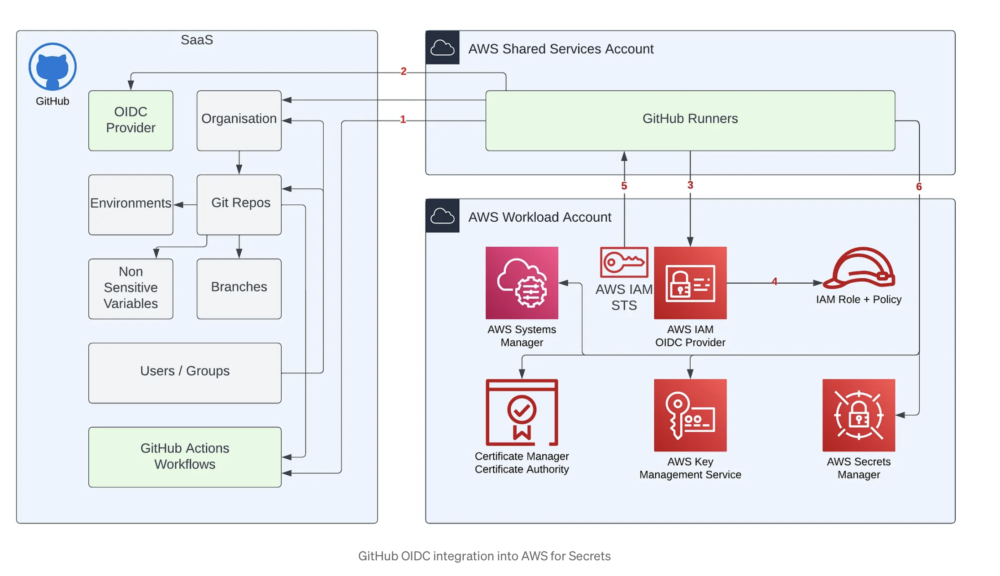

# GitHub Actions Secrets Integration with OIDC and AWS

Configuring OpenID Connect (OIDC) federation between GitHub Actions and AWS IAM — passwordless CI/CD authentication, with secrets pulled securely from AWS Secrets Manager, SSM Parameter Store, and KMS.

No long-lived AWS access keys are stored as GitHub secrets. Instead, each workflow run requests a short-lived OIDC token from GitHub, exchanges it for temporary AWS credentials via STS, and uses those to fetch secrets at runtime.

---

## Architecture



The numbered flow above maps to the steps below:

| # | Flow | Where it's implemented |
|---|---|---|
| 1 | Git Repo → GitHub Runners | Workflow trigger (`push` / `workflow_dispatch`) |
| 2 | Runners ↔ GitHub OIDC Provider | GitHub mints the JWT automatically (`id-token: write`) |
| 3 | Runners → AWS IAM OIDC Provider | `aws-actions/configure-aws-credentials@v4` presents the token |
| 4 | OIDC Provider → IAM Role + Policy | AWS validates the trust policy's `sub` / `aud` conditions |
| 5 | AWS STS → Runners | STS returns short-lived credentials to the runner |
| 6 | Secrets Manager → Runners | Workflow calls `aws secretsmanager get-secret-value` using those credentials |

Text-only version, for reference:

```
GitHub Repo → GitHub Runners → GitHub OIDC Provider
                    ↓
        AWS IAM OIDC Provider (validates token)
                    ↓
              IAM Role + Policy (trust + permissions)
                    ↓
                AWS STS (issues temp credentials)
                    ↓
   Secrets Manager / SSM Parameter Store / KMS
```

---

## 1. Create the IAM OIDC Identity Provider

```bash
aws iam create-open-id-connect-provider \
  --url https://token.actions.githubusercontent.com \
  --client-id-list sts.amazonaws.com \
  --thumbprint-list <thumbprint>
```

Verify it exists:

```bash
aws iam list-open-id-connect-providers
```

---

## 2. Create the IAM Role — Trust Policy

The trust policy controls **who** can assume the role. GitHub repositories created after **July 15, 2026** use an immutable subject-claim format that embeds numeric owner/repo IDs (protects against name-recycling attacks). Decode your token's `sub` claim and match it exactly:

```json
{
    "Version": "2012-10-17",
    "Statement": [
        {
            "Effect": "Allow",
            "Action": "sts:AssumeRoleWithWebIdentity",
            "Principal": {
                "Federated": "arn:aws:iam::<ACCOUNT_ID>:oidc-provider/token.actions.githubusercontent.com"
            },
            "Condition": {
                "StringEquals": {
                    "token.actions.githubusercontent.com:aud": "sts.amazonaws.com"
                },
                "StringLike": {
                    "token.actions.githubusercontent.com:sub": "repo:<owner>@<owner_id>/<repo>@<repo_id>:ref:refs/heads/main"
                }
            }
        }
    ]
}
```

**To find your actual `sub` claim**, add a debug step to any workflow:

```yaml
- name: Debug OIDC claims
  run: |
    curl -H "Authorization: bearer $ACTIONS_ID_TOKEN_REQUEST_TOKEN" \
      "$ACTIONS_ID_TOKEN_REQUEST_URL&audience=sts.amazonaws.com" \
      | jq -R 'split(".") | .[1] | @base64d | fromjson'
```

Apply the trust policy:

```bash
aws iam update-assume-role-policy \
  --role-name github-actions-oidc-role \
  --policy-document file://trust-policy.json
```

---

## 3. Create the IAM Role — Permissions Policy

The permissions policy controls **what** the role can do once assumed. This is separate from the trust policy (attached under the role's **Permissions** tab, not **Trust relationships**).

See [`oidc-permissions-policy.json`](./oidc-permissions-policy.json).

```bash
aws iam put-role-policy \
  --role-name github-actions-oidc-role \
  --policy-name aws-github-oidc-setup-secrets-access \
  --policy-document file://oidc-permissions-policy.json
```

> ⚠️ **SSM Parameter Store reserves any parameter name starting with `aws` or `ssm`** (case-insensitive) — no IAM policy can override this. Secrets Manager has no such restriction. This repo uses `aws-github-oidc-setup/*` for Secrets Manager and `github-oidc-setup/*` for SSM to work around it.

---

## 4. Create the AWS Resources

All resources below live in **us-east-2** — keep this consistent across every command, the workflow file, and the IAM policy ARNs, or calls will fail with "not found" errors that look unrelated to permissions.

```bash
# Secrets Manager
aws secretsmanager create-secret \
  --region us-east-2 \
  --name aws-github-oidc-setup/db-password \
  --secret-string 'yourpassword'

# SSM plain parameter
aws ssm put-parameter \
  --region us-east-2 \
  --name /github-oidc-setup/api-endpoint \
  --value 'https://ajaychinthapalli.github.io' \
  --type String

# (Optional) Customer-managed KMS key for encrypted parameters
aws kms create-key \
  --region us-east-2 \
  --description "aws-github-oidc-setup encrypted params" \
  --query KeyMetadata.KeyId --output text

aws kms create-alias \
  --region us-east-2 \
  --alias-name alias/aws-github-oidc-setup-key \
  --target-key-id <key-id-from-above>

# SSM SecureString parameter (KMS-backed)
aws ssm put-parameter \
  --region us-east-2 \
  --name /github-oidc-setup/encrypted-key \
  --value 'super-secret-value-here' \
  --type SecureString \
  --key-id alias/aws-github-oidc-setup-key
```

Verify each one:

```bash
aws secretsmanager describe-secret --region us-east-2 --secret-id aws-github-oidc-setup/db-password
aws ssm get-parameter --region us-east-2 --name /github-oidc-setup/api-endpoint
aws ssm get-parameter --region us-east-2 --name /github-oidc-setup/encrypted-key --with-decryption
```

---

## 5. The Workflow

See [`.github/workflows/secrets.yml`](./.github/workflows/secrets.yml).

Key points:
- `permissions: id-token: write` is required — without it, GitHub never issues a usable OIDC token
- `workflow_dispatch` is included so the job can be re-run manually from the Actions tab, not just on push
- Every sensitive value is passed through `::add-mask::` before being written to `$GITHUB_ENV`, so it never appears in plaintext in the logs

---

## 6. Running & Verifying

1. Push the workflow file, or trigger it manually: **Actions tab → Fetch Secrets via OIDC → Run workflow**
2. Expand each step in the run:
   - `Configure AWS credentials via OIDC` → should succeed silently
   - `Get secret from Secrets Manager` → masked as `***` in the log
   - `Get parameter from SSM` → plaintext value, no masking needed
   - `Get encrypted parameter (KMS-backed)` → masked, confirms `kms:Decrypt` works
   - `Use the secrets` → proves the env vars are usable downstream

---

## Common Errors & Fixes

| Error | Cause | Fix |
|---|---|---|
| `Not authorized to perform sts:AssumeRoleWithWebIdentity` | Trust policy `sub` condition doesn't match the actual token claim | Decode the token, compare claims, update trust policy |
| `AccessDeniedException: No access to reserved parameter name` | SSM parameter path starts with `aws` or `ssm` | Rename the SSM path prefix (Secrets Manager unaffected) |
| `NotFoundException` on KMS alias/key | Resource created in a different region than referenced elsewhere | Align every `--region` flag and ARN region segment |
| `Failed to create policy. Policy name is required.` | Console/CLI policy name field left blank | Provide an explicit `--policy-name` / fill the Name field on the review screen |

---

## Technologies

- AWS IAM · STS · OIDC
- AWS Secrets Manager · Systems Manager Parameter Store · KMS
- GitHub Actions · `aws-actions/configure-aws-credentials@v4`
- AWS CLI
